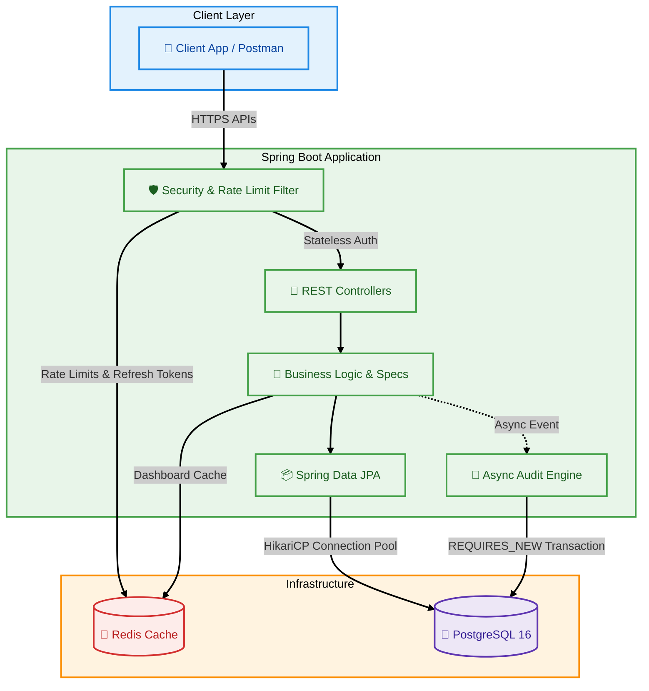
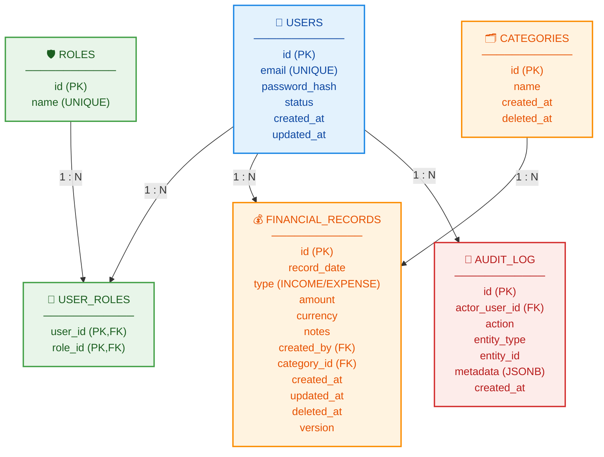

# 💰 Finance Dashboard Backend

A Spring Boot 3 REST API built for high-performance financial data processing, strict access control, and robust auditability.

---

## 💻 Tech Stack
*   **Java 17** | **Spring Boot 3.3.4** | **PostgreSQL 16** | **Redis 7** | **JUnit 5 / Testcontainers**

## 🚀 Core Features

This codebase focuses on solid backend engineering practices, security, and data integrity:

*   **🛡️ Strict RBAC**: Method-level security via Spring Security 6 with Redis-backed Refresh Token rotation.
*   **⚡ Smart Caching & Rate Limiting**: Distributed Bucket4j rate limiting and HTTP 304 (ETag) caching using Redis.
*   **🔐 Optimistic Locking & Soft Deletes**: `@Version` mapping to `If-Match` headers. Active partial-indexes for `deleted_at`.
*   **📜 Async Audit System**: Non-blocking `REQUIRES_NEW` transactions track every mutation transparently.
*   **💎 Idempotency & Filters**: `Idempotency-Key` headers for safe retries, and dynamic JPA `Specification` queries for advanced filtering.

---

## 🛠️ Engineering Decisions & Trade-offs

Consistent with assessing technical reasoning, here are the core trade-offs made:

**1. Data Precision (BigDecimal)**
*   **Decision**: Used `BigDecimal(19,2)` for all monetary values instead of `double`/`float`.
*   **Reasoning**: Prevents floating-point math rounding errors (e.g., `0.1 + 0.2 = 0.30000000000000004`).
*   **Trade-off**: Higher memory overhead and slightly slower calculations, but guarantees 100% currency accuracy.

**2. Stateless Auth + Redis Refresh Tokens**
*   **Decision**: JWT for fast access; UUIDs stored in Redis for refresh tokens.
*   **Reasoning**: Keeping refresh tokens in Redis allows for **instant revocation** (e.g., on logout or suspicious activity) without hitting the primary database.

**3. Soft Delete Strategy**
*   **Decision**: Financial records are never physically deleted; they are marked with a `deleted_at` timestamp.
*   **Reasoning**: Preserves a full "paper trail" for audit and forensic purposes.
*   **Trade-off**: The database grows larger over time. **Mitigation**: Implemented **Partial Indexes** (`WHERE deleted_at IS NULL`) so queries on active records remain lightning-fast.

---

## 🏗️ System Architecture



---

## 🗄️ Database Schema 



---

## 📋 API Documentation & Endpoints

**Interactive Explorer:** [https://tharun-raj-r.github.io/finance-dashboard/](https://tharun-raj-r.github.io/finance-dashboard/)

### 🔍 Core API Endpoints

| Controller | Route | Methods | Roles Allowed |
| :--- | :--- | :--- | :--- |
| **Auth** | `/api/v1/auth/login` | POST | All |
| **Auth** | `/api/v1/auth/refresh` | POST | All |
| **Users** | `/api/v1/users/**` | GET, POST, PATCH | ADMIN |
| **Categories** | `/api/v1/categories/**` | GET, POST, PUT, DELETE | ADMIN (Read: All) |
| **Records** | `/api/v1/records/**` | GET, POST, PUT, DELETE | ADMIN, ANALYST |
| **Dashboard** | `/api/v1/dashboard/summary` | GET | All |
| **Dashboard** | `/api/v1/dashboard/trends` | GET | All |
| **Audit** | `/api/v1/audit/**` | GET | ADMIN |

### 🔑 Test Credentials (RBAC)
*   **Admin**: `admin@finance.com` / `password` *(Full access)*
*   **Analyst**: `analyst@finance.com` / `password` *(View records & trends)*
*   **Viewer**: `viewer@finance.com` / `password` *(Read-only dashboard access)*

### 🏁 Quick Start
```bash
docker-compose up -d
mvn spring-boot:run
```

---

## 🏆 Test Coverage Highlights

> **126 Integration Tests Passed (100% Success Rate).** 
> *Fully tested across HTTP layers, Security, Concurrency, and Transactions using JUnit 5 & Testcontainers.*

```text
[INFO] -------------------------------------------------------
[INFO]  T E S T S
[INFO] -------------------------------------------------------
[INFO] Running com.finance.dashboard.RecordIntegrationTest
[INFO] ...
[INFO] Results:
[INFO] 
[INFO] Tests run: 126, Failures: 0, Errors: 0, Skipped: 0
[INFO] 
[INFO] -------------------------------------------------------
[INFO] BUILD SUCCESS
[INFO] -------------------------------------------------------
```
