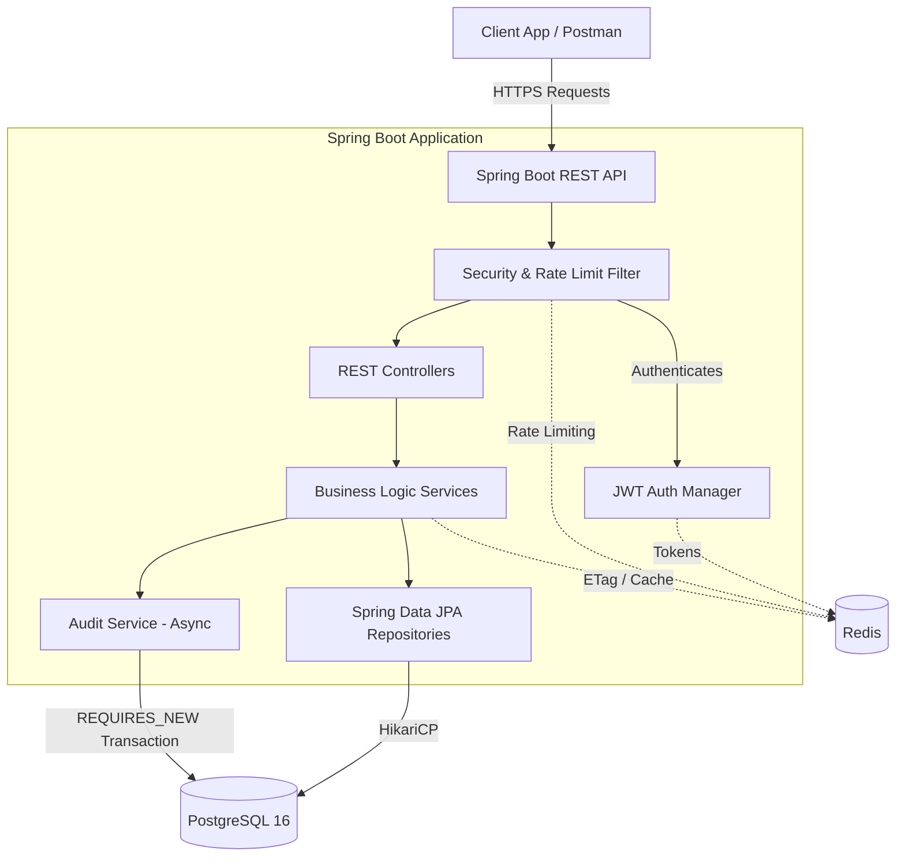
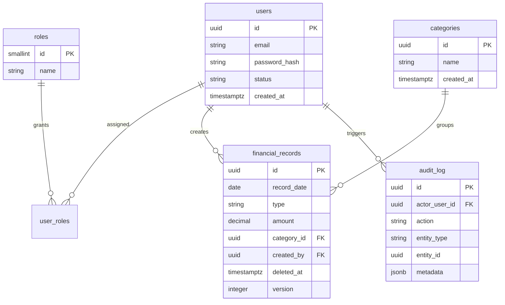

# 💰 Finance Dashboard Backend 📈

A Spring Boot 3.3.4 REST API built for high-performance financial data processing, strict access control, and robust auditability.

---

## 💻 Tech Stack
*   **Java 17** & **Spring Boot 3.3.4** (Web, Data JPA, Security, Validation)
*   **PostgreSQL 16** (Primary Database, Flyway Migrations)
*   **Redis 7** (Caching, distributed rate-limiting, and refresh-token storage)
*   **JUnit 5** & **Testcontainers** (Integration testing)
*   **OpenAPI 3.0** (Swagger/Redoc Documentation)

## 🚀 Core Features Implemented

This project is structured around solid backend engineering practices, focusing heavily on security, data integrity, and proper state management:

*   **🛡️ Strict RBAC**: Method-level security using Spring Security 6.
*   **🔄 Refresh Token Rotation**: Secure session management using Redis to prevent token theft replay.
*   **⚡ Smart Caching (ETags)**: Implemented `ShallowEtagHeaderFilter` to support **HTTP 304 Not Modified**, saving bandwidth for dashboard mobile users.
*   **🔐 Optimistic Locking**: Implementation of `@Version` with `If-Match` headers to prevent the "Lost Update" problem in financial records.
*   **🚦 Distributed Rate Limiting**: Redis-backed protection for the login endpoint to stop brute-force attacks.
*   **📜 Async Audit System**: A custom, non-blocking audit logger that tracks every change (Create/Update/Delete) in a separate transaction (`REQUIRES_NEW`).
*   **💎 Idempotency Keys**: Support for `Idempotency-Key` headers on record creation to prevent duplicates during network retries.
*   **🧪 High Test Coverage**: **126 Integration Tests** covering the full HTTP stack, security, and concurrency.

---

## 🏗️ System Architecture



## 🗄️ Database Schema (ERD)



## 🛠️ Technical Decisions & Trade-offs

### 1. Data Precision (BigDecimal over Double)
**Decision**: Used `BigDecimal(19,2)` for all monetary values.
**Reasoning**: Floating-point math (`double`/`float`) causes rounding errors (e.g., `0.1 + 0.2 = 0.30000000000000004`). In finance, this is unacceptable.
**Trade-off**: Higher memory usage and slightly slower calculations, but 100% currency accuracy.

### 2. Stateless Auth + Redis Refresh Tokens
**Decision**: JWT for access tokens; UUIDs in Redis for refresh tokens.
**Reasoning**: Keeping refresh tokens in Redis allows for **instant revocation** (e.g., on logout or suspicious activity) without the overhead of a database table.
**Trade-off**: Adds a dependency on Redis, but significantly improves security and performance.

### 3. Soft Delete Strategy
**Decision**: Records are never physically deleted; they are marked with `deleted_at`.
**Reasoning**: Financial records are sensitive. We must preserve a full "paper trail" for audit and forensic purposes.
**Trade-off**: Database grows larger over time. We mitigated this by using **Partial Indexes** (`WHERE deleted_at IS NULL`) so active queries remain lightning-fast.

### 4. Async Audit Logging
**Decision**: Used `@Async` with a `ThreadPoolTaskExecutor`.
**Reasoning**: Writing an audit log shouldn't make the user wait. By doing it asynchronously in a "New Transaction," we ensure the audit is saved even if the main operation fails later.

---

## 📋 API Documentation & Setup

### 🌐 Live API Explorer
**Interactive Documentation:** [https://tharun-raj-r.github.io/finance-dashboard/](https://tharun-raj-r.github.io/finance-dashboard/)

### 🏗️ Running Locally
1. **Infrastructure**: `docker-compose up -d` (Starts PostgreSQL 16 & Redis 7).
2. **Launch**: `mvn spring-boot:run`.
3. **Swagger UI**: [http://localhost:8080/swagger-ui.html](http://localhost:8080/swagger-ui.html).

### 🔑 Default Test Credentials
Use these pre-seeded accounts to test Role-Based Access Control (RBAC):
*   **Admin**: `admin@finance.com` / `password` *(Full access)*
*   **Analyst**: `analyst@finance.com` / `password` *(Can view records/trends)*
*   **Viewer**: `viewer@finance.com` / `password` *(Read-only dashboard)*

### 📖 Full API Endpoint Index

| Resource | Endpoints | Roles Allowed |
| :--- | :--- | :--- |
| **Auth** | `POST /api/v1/auth/login`<br>`POST /api/v1/auth/refresh` | Anonymous |
| **Users** | `GET /api/v1/users`<br>`POST /api/v1/users`<br>`GET /api/v1/users/{id}`<br>`PATCH /api/v1/users/{id}`<br>`GET /api/v1/users/me` | ADMIN (except `/me`) |
| **Categories** | `GET /api/v1/categories`<br>`POST /api/v1/categories`<br>`GET /api/v1/categories/{id}`<br>`PUT /api/v1/categories/{id}`<br>`DELETE /api/v1/categories/{id}` | ADMIN (Write) /<br>ALL (Read) |
| **Records** | `GET /api/v1/records`<br>`POST /api/v1/records`<br>`GET /api/v1/records/{id}`<br>`PUT /api/v1/records/{id}`<br>`DELETE /api/v1/records/{id}`<br>`POST /api/v1/records/bulk`<br>`GET /api/v1/records/export` | ADMIN (Write) /<br>ANALYST (Read) |
| **Dashboard** | `GET /api/v1/dashboard/summary`<br>`GET /api/v1/dashboard/trends`<br>`GET /api/v1/dashboard/by-category`<br>`GET /api/v1/dashboard/recent-activity` | ALL ROLES |
| **Audit** | `GET /api/v1/audit`<br>`GET /api/v1/audit/record/{recordId}`<br>`GET /api/v1/audit/entity/{entityType}` | ADMIN |

---

## 🧪 Verification & Testing
The project includes a comprehensive test suite of **126 tests** with 100% passing rate.
```bash
mvn clean test
```
*   **`AuditIntegrationTest`**: Verifies that every single Create/Update/Delete action is tracked asynchronously in a new transaction.
*   **`AuthIntegrationTest`**: Tests JWT refresh token rotation, strict password policies, rate limiting (Redis), and RBAC limits.
*   **`RecordIntegrationTest`**: Tests massive data filtering, Idempotency-Key handling, Optimistic Locking (`@Version`), and Soft Deletes.
*   **`CategoryIntegrationTest`**: Tests category CRUD, soft-deletion boundaries, and referential integrity (prevents deleting active categories).
*   **`DashboardIntegrationTest`**: Tests time-series aggregations, caching integration (Redis), and ETags mapping.
*   **`UserIntegrationTest`**: Verifies Admin user management boundaries, email collision safeguards, and custom profile queries.

---

## 📝 Assumptions
1. **Single Currency**: All calculations assume a primary currency (e.g., USD) as the system doesn't currently handle real-time exchange rate conversions.
2. **Email as ID**: Emails are unique and used as the primary identifier for login.
3. **Timezones**: All timestamps are stored and handled in **UTC**.

---

## 🔮 Future Roadmap
If given more time, I would expand the system with the following:
1.  **Event-Driven Audit logging**: Move the Audit logging from `@Async` to an event broker like **Apache Kafka** or RabbitMQ to decouple the database load entirely.
2.  **System Observability**: Implement the **ELK Stack** (Elasticsearch, Logstash, Kibana) for centralized logging, and Prometheus/Grafana via Micrometer for JVM metrics.
3.  **CI/CD Pipeline**: Add GitHub Actions to automatically run the `Testcontainers` test suite on every pull request and build a Docker image upon push to `main`.
