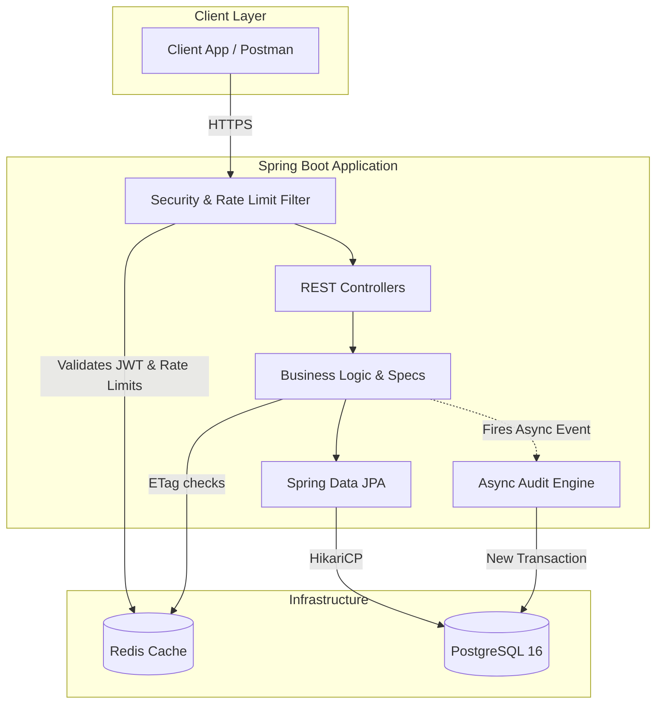
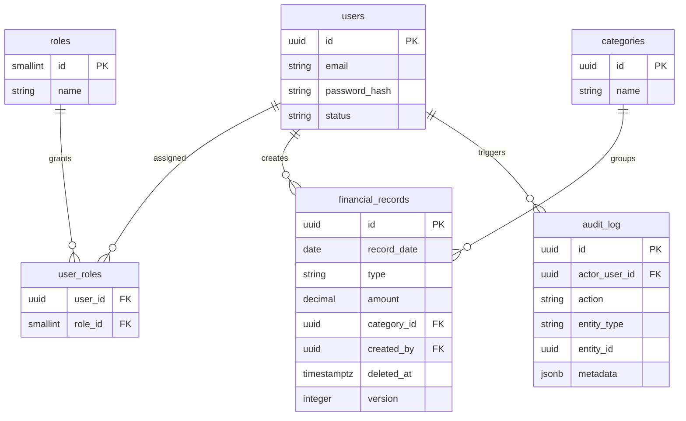

# 💰 Finance Dashboard Backend

> 🏆 **126 Integration Tests Passed (100% Success Rate).** 
> *Fully tested across HTTP layers, Security, Concurrency, and Transactions using JUnit 5 & Testcontainers.*

A Spring Boot 3 REST API built for high-performance financial data processing, strict access control, and robust auditability.

---

## 💻 Tech Stack
*   **Java 17** | **Spring Boot 3.3.4** | **PostgreSQL 16** | **Redis 7** | **JUnit 5 / Testcontainers**

## 🚀 Core Architectural Features

*   **🛡️ Strict RBAC & Stateless Security**: Method-level security via Spring Security 6 with Redis-backed Refresh Token rotation.
*   **⚡ Smart Caching & Rate Limiting**: Distributed Bucket4j rate limiting and HTTP 304 (ETag) caching using Redis.
*   **🔐 Optimistic Locking & Soft Deletes**: `@Version` mapping to `If-Match` headers. Active partial-indexes for `deleted_at`.
*   **📜 Async Audit System**: Non-blocking `REQUIRES_NEW` transactions track every mutation transparently.
*   **💎 Idempotency & Data Filtering**: `Idempotency-Key` headers for safe retries, and dynamic JPA `Specification` queries.

---

## 🏗️ System Architecture



## 🗄️ Database Schema 



---

## 📋 API Documentation & Setup

**Interactive Explorer:** [https://tharun-raj-r.github.io/finance-dashboard/](https://tharun-raj-r.github.io/finance-dashboard/)

### 🔑 Test Credentials (RBAC)
*   **Admin**: `admin@finance.com` / `password` *(Full access)*
*   **Analyst**: `analyst@finance.com` / `password` *(View records & trends)*
*   **Viewer**: `viewer@finance.com` / `password` *(Read-only dashboard access)*

### 🏁 Quick Start
```bash
docker-compose up -d
mvn spring-boot:run
```

*Note: For the full list of endpoint routes, request schemas, and parameter filters, please refer directly to the Live API Explorer link above.*
