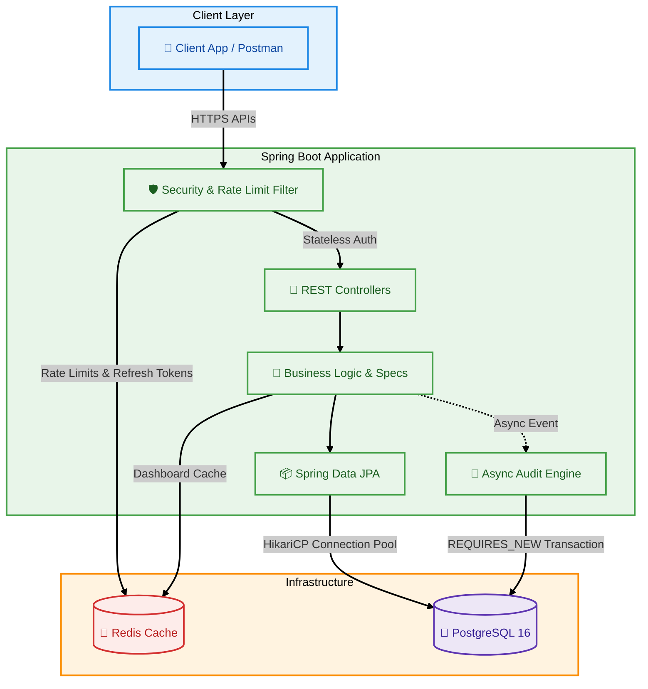

# 💰 Finance Dashboard Backend

A Spring Boot 3 REST API built for high-performance financial data processing, strict access control, and robust auditability.

---

## 💻 Tech Stack
*   **Java 17** | **Spring Boot 3.3.4** | **PostgreSQL 16** | **Redis 7** | **JUnit 5 / Testcontainers**

---

## 🏗️ System Architecture



---

## 🚀 Core Features

This codebase focuses on solid backend engineering practices, security, and data integrity:

*   **🛡️ Strict RBAC**: Method-level security via Spring Security 6 with Redis-backed Refresh Token rotation.
*   **⚡ Smart Caching & Rate Limiting**: Distributed Bucket4j rate limiting and HTTP 304 (ETag) caching using Redis.
*   **🔐 Optimistic Locking & Soft Deletes**: `@Version` mapping to `If-Match` headers. Active partial-indexes for `deleted_at`.
*   **📜 Async Audit System**: Non-blocking `REQUIRES_NEW` transactions track every mutation transparently.
*   **💎 Idempotency & Filters**: `Idempotency-Key` headers for safe retries, and dynamic JPA `Specification` queries for advanced filtering.

---

## 🗄️ Database Schema 


---

## 🛠️ Engineering Decisions & Trade-offs

Consistent with assessing technical reasoning, here are the core trade-offs made:

**1. Data Precision (BigDecimal)**
*   **Decision**: Used `BigDecimal(19,2)` for all monetary values instead of `double`/`float`.
*   **Reasoning**: Prevents floating-point math rounding errors (e.g., `0.1 + 0.2 = 0.30000000000000004`).
*   **Trade-off**: Higher memory overhead and slightly slower calculations, but guarantees 100% currency accuracy.

**2. Stateless Auth + Redis Refresh Tokens**
*   **Decision**: JWT for fast access; UUIDs stored in Redis for refresh tokens.
*   **Reasoning**: Keeping refresh tokens in Redis allows for **instant revocation** (e.g., on logout or suspicious activity) without hitting the primary database.

**3. Soft Delete Strategy**
*   **Decision**: Financial records are never physically deleted; they are marked with a `deleted_at` timestamp.
*   **Reasoning**: Preserves a full "paper trail" for audit and forensic purposes.
*   **Trade-off**: The database grows larger over time. **Mitigation**: Implemented **Partial Indexes** (`WHERE deleted_at IS NULL`) so queries on active records remain lightning-fast.

---

## 🏁 Quick Start & Setup

### 🔑 Test Credentials (RBAC)
*   **Admin**: `admin@finance.com` / `password` *(Full access)*
*   **Analyst**: `analyst@finance.com` / `password` *(View records & trends)*
*   **Viewer**: `viewer@finance.com` / `password` *(Read-only dashboard access)*

### 🚀 Running the API
```bash
# Start PostgreSQL & Redis
docker-compose up -d

# Start Spring Boot Application
mvn spring-boot:run
```

### ✅ Running the Test Suite
```bash
# Will spin up fresh Testcontainers and run all 126 integration tests
mvn clean test
```

---

## 📋 Comprehensive API Endpoints

**Interactive Explorer:** [https://tharun-raj-r.github.io/finance-dashboard/](https://tharun-raj-r.github.io/finance-dashboard/)

### 🔐 Auth
| Method | Endpoint | Description | Roles |
| :--- | :--- | :--- | :--- |
| `🔵 POST` | `/api/v1/auth/login` | Authenticate and obtain JWT access & refresh token pair | All |
| `🔵 POST` | `/api/v1/auth/refresh` | Exchange a refresh token for a new access token (tokens are rotated) | All |

### 👤 Users
| Method | Endpoint | Description | Roles |
| :--- | :--- | :--- | :--- |
| `🟢 GET` | `/api/v1/users/me` | Get current user's profile | All |
| `🟢 GET` | `/api/v1/users` | List all users (Paginated) | ADMIN |
| `🟢 GET` | `/api/v1/users/{id}` | Get specific user by ID | ADMIN |
| `🔵 POST` | `/api/v1/users` | Create a new user | ADMIN |
| `🟠 PATCH`| `/api/v1/users/{id}` | Partially update a user's status and/or roles | ADMIN |

### 🗂️ Categories
| Method | Endpoint | Description | Roles |
| :--- | :--- | :--- | :--- |
| `🟢 GET` | `/api/v1/categories` | List all active categories | All |
| `🟢 GET` | `/api/v1/categories/{id}` | Get category by ID | All |
| `🔵 POST` | `/api/v1/categories` | Create a new category | ADMIN |
| `🟡 PUT` | `/api/v1/categories/{id}` | Rename a category | ADMIN |
| `🔴 DELETE`| `/api/v1/categories/{id}` | Soft-delete a category. Returns 409 if active records reference it. | ADMIN |

### 💰 Financial Records
| Method | Endpoint | Description | Roles |
| :--- | :--- | :--- | :--- |
| `🟢 GET` | `/api/v1/records` | List records with dynamic filtering (date, type, category) | ADMIN, ANALYST |
| `🟢 GET` | `/api/v1/records/{id}` | Get record by ID. Returns `ETag` header. | ADMIN, ANALYST |
| `🟢 GET` | `/api/v1/records/export`| Export records as CSV download using the same filters | ADMIN, ANALYST |
| `🔵 POST` | `/api/v1/records` | Create record. Supports `Idempotency-Key` header. | ADMIN |
| `🔵 POST` | `/api/v1/records/bulk` | Bulk create records atomically (All or Nothing). | ADMIN |
| `🟡 PUT` | `/api/v1/records/{id}` | Fully update a record. Requires `If-Match` header. | ADMIN |
| `🔴 DELETE`| `/api/v1/records/{id}` | Soft-delete a record. Requires `If-Match` header for safety. | ADMIN |

### 📊 Dashboard
| Method | Endpoint | Description | Roles |
| :--- | :--- | :--- | :--- |
| `🟢 GET` | `/api/v1/dashboard/summary`| Get total income, expenses, and net balance | All |
| `🟢 GET` | `/api/v1/dashboard/trends` | Get income vs expense trend | All |
| `🟢 GET` | `/api/v1/dashboard/by-category`| Get income/expense totals grouped by category | All |
| `🟢 GET` | `/api/v1/dashboard/recent-activity` | Analyst sees full records; Viewer sees strictly summary totals. | All |

### 📜 Audit Log
| Method | Endpoint | Description | Roles |
| :--- | :--- | :--- | :--- |
| `🟢 GET` | `/api/v1/audit` | List all async audit logs, newest first | ADMIN |
| `🟢 GET` | `/api/v1/audit/record/{id}`| Complete history trailing for a single record ID | ADMIN |
| `🟢 GET` | `/api/v1/audit/entity/{type}`| Filter logs by entity type (e.g. FinancialRecord) | ADMIN |

---

## 🏆 Test Coverage Highlights

> **126 Integration Tests Passed (100% Success Rate).** 
> *Fully tested across HTTP layers, Security, Concurrency, and Transactions using JUnit 5 & Testcontainers.*

```text
[INFO] -------------------------------------------------------
[INFO]  T E S T S
[INFO] -------------------------------------------------------
[INFO] Running com.finance.dashboard.RecordIntegrationTest
[INFO] Running com.finance.dashboard.AuthIntegrationTest
[INFO] Running com.finance.dashboard.AuditIntegrationTest
[INFO] ...
[INFO] Results:
[INFO] 
[INFO] Tests run: 126, Failures: 0, Errors: 0, Skipped: 0
[INFO] 
[INFO] -------------------------------------------------------
[INFO] BUILD SUCCESS
[INFO] -------------------------------------------------------
```

---

## 🔮 Future Enhancements
*   **Message Broker for Audit Logs**: Replace Spring `@Async` with **Apache Kafka** to offload DB write pressure during high-scale usage.
*   **Advanced Observability**: Implement the **ELK Stack** (Elasticsearch, Logstash, Kibana) and **Prometheus/Grafana** for metrics visualization.
*   **CI/CD Pipeline**: Migrate existing `Testcontainers` suite into GitHub Actions for automated pull-request verification and Docker imaging.
